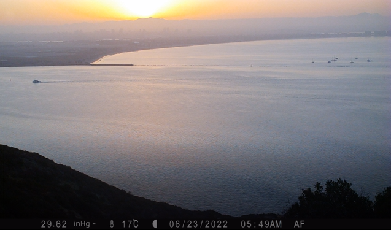

# Fog Monitoring Project

The goal of this project is to capture the intensity and duration of summer time fog at the Cabrillo National Monument. This code repository is the one stop shop to process the resulting CR800 .DAT files, WEEWX .SDB files, and Browning .TLS files from stations installed in Summer 2022 via Scientists in Parks (SIP).

## CR800 .DAT Files
Run `clean_dat_file.Rmd` with all of the folders present in raw_data and processed_data folders ('TP','EB','NN','SB')

## Davis Vantage Pro2 .SDB Files
Install SQLite Studio (https://sqlitestudio.pl/) and export to a .CSV

## Browning .TLS files
Run `set_camera_filenames.Rmd` with all folders present in raw_data and processed_data ('AF','CM')